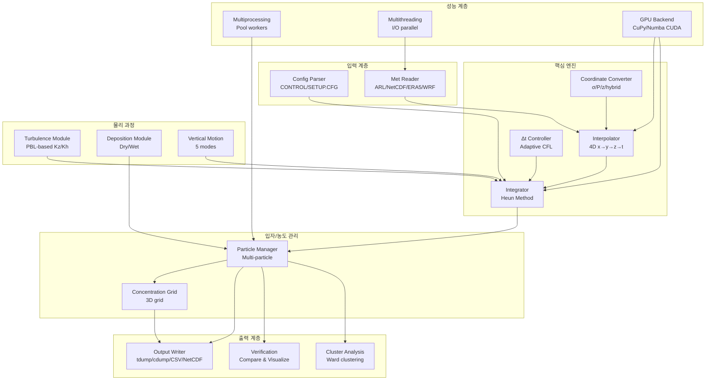
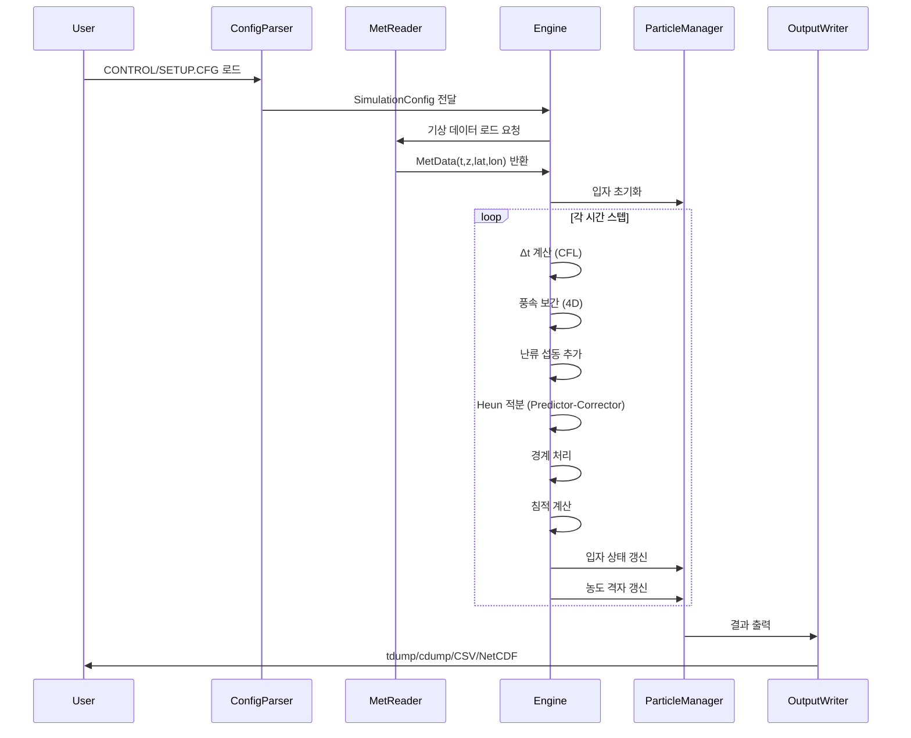

# 설계 문서: HYSPLIT Trajectory Engine

## 개요

본 설계는 NOAA HYSPLIT 대기 수송 및 확산 모델링 시스템을 Python으로 완전히 재구현하는 `pyhysplit` 패키지의 아키텍처를 정의한다. 핵심 목표는 HYSPLIT과 수치적으로 동일한 궤적/확산 결과를 산출하면서, 멀티프로세싱/멀티쓰레딩/GPU 가속을 통해 성능을 극대화하는 것이다.

설계 원칙:
- HYSPLIT 알고리즘의 정확한 재현 (Heun 적분, x→y→z→t 보간 순서)
- 모듈화된 구조로 각 물리 과정을 독립적으로 테스트 가능
- CPU/GPU 백엔드 추상화를 통한 투명한 가속
- HYSPLIT CONTROL/SETUP.CFG 파일 완전 호환

## 아키텍처



### 실행 흐름



## 컴포넌트 및 인터페이스

### 1. Config Parser (`config_parser.py`)

HYSPLIT CONTROL 파일과 SETUP.CFG 파일을 파싱하여 Python 데이터 구조로 변환한다.

```python
@dataclass
class StartLocation:
    lat: float        # 위도 (degrees)
    lon: float        # 경도 (degrees)
    height: float     # 고도 (m AGL)

@dataclass
class ConcentrationGridConfig:
    center_lat: float
    center_lon: float
    spacing_lat: float
    spacing_lon: float
    span_lat: float
    span_lon: float
    levels: list[float]          # 수직 레벨 (m)
    sampling_start: datetime
    sampling_end: datetime
    averaging_period: int        # 시간 (hours)

@dataclass
class SimulationConfig:
    start_time: datetime
    num_start_locations: int
    start_locations: list[StartLocation]
    total_run_hours: int         # 양수=forward, 음수=backward
    vertical_motion: int         # 0=data, 1=isodensity, 2=isobaric, 3=isentropic, 4=isosigma
    model_top: float             # 모델 상한 (m AGL)
    met_files: list[tuple[str, str]]  # (directory, filename) 쌍
    concentration_grids: list[ConcentrationGridConfig]
    # SETUP.CFG 파라미터
    num_particles: int = 2500
    max_particles: int = 10000
    kmixd: int = 0               # 혼합층 깊이 계산 방식
    kmix0: int = 250             # 최소 혼합층 깊이 (m)
    mgmin: int = 10              # 최소 격자 간격 (km)
    khmax: float = 9999.0        # 최대 수평 확산 계수
    dt_max: float = 3600.0       # 최대 시간 간격 (s)
    sigma: float = 0.0           # 단순 난류 σ (비활성화 시 0)
    dry_deposition: bool = False
    wet_deposition: bool = False
    turbulence_on: bool = True
```

### 2. Met Reader (`met_reader.py`)

다양한 기상 데이터 포맷을 읽어 통일된 내부 구조로 변환한다.

```python
@dataclass
class MetData:
    u: np.ndarray          # (t, z, lat, lon) 동서 바람 (m/s)
    v: np.ndarray          # (t, z, lat, lon) 남북 바람 (m/s)
    w: np.ndarray          # (t, z, lat, lon) 수직 속도 (m/s)
    t_field: np.ndarray    # (t, z, lat, lon) 온도 (K) - optional
    rh: np.ndarray         # (t, z, lat, lon) 상대습도 (%) - optional
    hgt: np.ndarray        # (t, z, lat, lon) 지오포텐셜 높이 (m) - optional
    precip: np.ndarray     # (t, lat, lon) 강수율 (mm/h) - optional
    pbl_height: np.ndarray # (t, lat, lon) PBL 높이 (m) - optional
    terrain: np.ndarray    # (lat, lon) 지형 높이 (m)
    lon_grid: np.ndarray   # 1D 경도 격자
    lat_grid: np.ndarray   # 1D 위도 격자
    z_grid: np.ndarray     # 1D 수직 격자 (pressure 또는 height)
    t_grid: np.ndarray     # 1D 시간 격자 (seconds since reference)
    z_type: str            # "pressure" 또는 "height"
    source: str            # "ARL", "GDAS_NC", "GFS_NC", "ERA5", "WRF", "NAM"

class MetReaderBase(ABC):
    @abstractmethod
    def read(self, filepath: str) -> MetData: ...
    
    @abstractmethod
    def get_variable_mapping(self) -> dict[str, str]: ...

class ARLReader(MetReaderBase):
    """NOAA ARL packed binary 포맷 리더"""
    HEADER_SIZE = 50  # bytes
    
    def read(self, filepath: str) -> MetData: ...
    def _parse_index_record(self, data: bytes) -> dict: ...
    def _unpack_level_data(self, data: bytes, nx: int, ny: int) -> np.ndarray: ...

class NetCDFReader(MetReaderBase):
    """NetCDF 포맷 리더 (GDAS/GFS)"""
    def read(self, filepath: str) -> MetData: ...

class ERA5Reader(MetReaderBase):
    """ECMWF ERA5 리더"""
    def read(self, filepath: str) -> MetData: ...

class WRFReader(MetReaderBase):
    """WRF 출력 리더"""
    def read(self, filepath: str) -> MetData: ...

class MetReaderFactory:
    @staticmethod
    def create(source_type: str) -> MetReaderBase: ...

def convert_omega_to_w(omega: np.ndarray, T: np.ndarray, P: np.ndarray,
                       Rd: float = 287.05, g: float = 9.80665) -> np.ndarray:
    """Pa/s → m/s 변환: w = -omega * Rd * T / (g * P)"""
    return -omega * Rd * T / (g * P)

def concatenate_met_files(readers: list[MetReaderBase], filepaths: list[str]) -> MetData:
    """다중 기상 파일을 시간 순서로 연결"""
    ...
```

### 3. Coordinate Converter (`coordinate_converter.py`)

수직 좌표계 간 변환을 수행한다.

```python
class CoordinateConverter:
    @staticmethod
    def sigma_to_pressure(sigma: np.ndarray, p_sfc: np.ndarray, 
                          p_top: float = 0.0) -> np.ndarray:
        """σ = (P - P_top)/(P_sfc - P_top) → P"""
        return sigma * (p_sfc - p_top) + p_top
    
    @staticmethod
    def hybrid_to_pressure(A: np.ndarray, B: np.ndarray, 
                           p_sfc: np.ndarray) -> np.ndarray:
        """P = A(k) + B(k) * P_sfc"""
        return A[:, None, None] + B[:, None, None] * p_sfc[None, :, :]
    
    @staticmethod
    def pressure_to_height(P: np.ndarray, hgt: np.ndarray = None,
                           P0: float = 101325.0, H: float = 8500.0) -> np.ndarray:
        """기압 → 고도 변환. hgt 있으면 지오포텐셜 사용, 없으면 표준대기 근사"""
        if hgt is not None:
            return hgt
        return -H * np.log(P / P0)
    
    @staticmethod
    def height_to_pressure(z: np.ndarray, P0: float = 101325.0, 
                           H: float = 8500.0) -> np.ndarray:
        """고도 → 기압 변환 (표준대기 근사)"""
        return P0 * np.exp(-z / H)
    
    @staticmethod
    def terrain_correction(z_agl: np.ndarray, terrain_height: np.ndarray) -> np.ndarray:
        """AGL → ASL 변환"""
        return z_agl + terrain_height
```

### 4. Interpolator (`interpolator.py`)

HYSPLIT과 동일한 x→y→z→t 순서의 4D 보간을 수행한다.

```python
EARTH_RADIUS = 6_371_000.0  # meters

class Interpolator:
    def __init__(self, met: MetData):
        self.met = met
    
    def trilinear(self, var_3d: np.ndarray, lon: float, lat: float, z: float) -> float:
        """x→y→z 순서 trilinear 보간. 순서 변경 불가."""
        lon_grid, lat_grid, z_grid = self.met.lon_grid, self.met.lat_grid, self.met.z_grid
        
        i = np.searchsorted(lon_grid, lon) - 1
        j = np.searchsorted(lat_grid, lat) - 1
        k = np.searchsorted(z_grid, z) - 1
        
        # 경계 검사
        if not (0 <= i < len(lon_grid)-1 and 0 <= j < len(lat_grid)-1 and 0 <= k < len(z_grid)-1):
            raise BoundaryError(f"Position ({lon}, {lat}, {z}) outside grid")
        
        xd = (lon - lon_grid[i]) / (lon_grid[i+1] - lon_grid[i])
        yd = (lat - lat_grid[j]) / (lat_grid[j+1] - lat_grid[j])
        zd = (z - z_grid[k]) / (z_grid[k+1] - z_grid[k])
        
        # x 방향 보간 (4쌍)
        c00 = var_3d[k,   j,   i] * (1-xd) + var_3d[k,   j,   i+1] * xd
        c01 = var_3d[k,   j+1, i] * (1-xd) + var_3d[k,   j+1, i+1] * xd
        c10 = var_3d[k+1, j,   i] * (1-xd) + var_3d[k+1, j,   i+1] * xd
        c11 = var_3d[k+1, j+1, i] * (1-xd) + var_3d[k+1, j+1, i+1] * xd
        
        # y 방향 보간 (2쌍)
        c0 = c00 * (1-yd) + c01 * yd
        c1 = c10 * (1-yd) + c11 * yd
        
        # z 방향 보간
        return c0 * (1-zd) + c1 * zd
    
    def interpolate_4d(self, lon: float, lat: float, z: float, t: float) -> tuple[float, float, float]:
        """4D 보간: 공간(x→y→z) 후 시간(t). u, v, w 반환."""
        t_grid = self.met.t_grid
        it = np.searchsorted(t_grid, t) - 1
        
        if not (0 <= it < len(t_grid) - 1):
            raise BoundaryError(f"Time {t} outside range [{t_grid[0]}, {t_grid[-1]}]")
        
        dt_frac = (t - t_grid[it]) / (t_grid[it+1] - t_grid[it])
        
        # 각 시간 스냅샷에서 공간 보간 후 시간 보간
        u = self.trilinear(self.met.u[it], lon, lat, z) * (1-dt_frac) + \
            self.trilinear(self.met.u[it+1], lon, lat, z) * dt_frac
        v = self.trilinear(self.met.v[it], lon, lat, z) * (1-dt_frac) + \
            self.trilinear(self.met.v[it+1], lon, lat, z) * dt_frac
        w = self.trilinear(self.met.w[it], lon, lat, z) * (1-dt_frac) + \
            self.trilinear(self.met.w[it+1], lon, lat, z) * dt_frac
        
        return u, v, w
    
    def interpolate_scalar(self, var_4d: np.ndarray, lon: float, lat: float, 
                           z: float, t: float) -> float:
        """임의의 스칼라 변수에 대한 4D 보간"""
        t_grid = self.met.t_grid
        it = np.searchsorted(t_grid, t) - 1
        dt_frac = (t - t_grid[it]) / (t_grid[it+1] - t_grid[it])
        return self.trilinear(var_4d[it], lon, lat, z) * (1-dt_frac) + \
               self.trilinear(var_4d[it+1], lon, lat, z) * dt_frac
```

### 5. Integrator (`integrator.py`)

Heun(Modified Euler) Predictor-Corrector 적분과 적응형 Δt 제어를 수행한다.

```python
class HeunIntegrator:
    def __init__(self, interpolator: Interpolator, turbulence: TurbulenceModule = None):
        self.interp = interpolator
        self.turbulence = turbulence
    
    @staticmethod
    def advect_lonlat(lon: float, lat: float, u: float, v: float, dt: float) -> tuple[float, float]:
        """지구 곡률 기반 lon/lat 이동"""
        lat_rad = np.deg2rad(lat)
        dlat = (v * dt) / EARTH_RADIUS
        dlon = (u * dt) / (EARTH_RADIUS * np.cos(lat_rad))
        return lon + np.rad2deg(dlon), lat + np.rad2deg(dlat)
    
    def step(self, lon: float, lat: float, z: float, t: float, dt: float) -> tuple[float, float, float]:
        """Heun 적분 1스텝: P(t+dt) = P(t) + 0.5*(V1+V2)*dt"""
        # Predictor
        u1, v1, w1 = self.interp.interpolate_4d(lon, lat, z, t)
        if self.turbulence:
            du, dv, dw = self.turbulence.get_perturbation(lon, lat, z, t, dt)
            u1 += du; v1 += dv; w1 += dw
        
        lon_p, lat_p = self.advect_lonlat(lon, lat, u1, v1, dt)
        z_p = z + w1 * dt
        
        # Corrector
        u2, v2, w2 = self.interp.interpolate_4d(lon_p, lat_p, z_p, t + dt)
        if self.turbulence:
            du, dv, dw = self.turbulence.get_perturbation(lon_p, lat_p, z_p, t + dt, dt)
            u2 += du; v2 += dv; w2 += dw
        
        # Average
        u_avg = 0.5 * (u1 + u2)
        v_avg = 0.5 * (v1 + v2)
        w_avg = 0.5 * (w1 + w2)
        
        lon_new, lat_new = self.advect_lonlat(lon, lat, u_avg, v_avg, dt)
        z_new = z + w_avg * dt
        
        return lon_new, lat_new, z_new

class AdaptiveDtController:
    def __init__(self, met: MetData, config: SimulationConfig):
        self.met = met
        self.config = config
        self._dx = self._compute_grid_spacing()
    
    def _compute_grid_spacing(self) -> tuple[float, float]:
        """격자 간격을 미터 단위로 계산"""
        dlon = abs(self.met.lon_grid[1] - self.met.lon_grid[0])
        dlat = abs(self.met.lat_grid[1] - self.met.lat_grid[0])
        mid_lat = np.mean(self.met.lat_grid)
        dx = dlon * np.deg2rad(1) * EARTH_RADIUS * np.cos(np.deg2rad(mid_lat))
        dy = dlat * np.deg2rad(1) * EARTH_RADIUS
        return dx, dy
    
    def compute_dt(self, u: float, v: float, w: float, t: float) -> float:
        """CFL 기반 적응형 Δt 계산"""
        dx, dy = self._dx
        speed_u = max(abs(u), 0.001)
        speed_v = max(abs(v), 0.001)
        
        dt_x = dx / speed_u
        dt_y = dy / speed_v
        dt = min(dt_x, dt_y, self.config.dt_max)
        
        # 수직 CFL
        if abs(w) > 0.001 and len(self.met.z_grid) > 1:
            dz = abs(self.met.z_grid[1] - self.met.z_grid[0])
            dt_z = dz / abs(w)
            dt = min(dt, dt_z)
        
        # 기상자료 시간 경계 클리핑
        t_grid = self.met.t_grid
        it = np.searchsorted(t_grid, t) - 1
        if 0 <= it < len(t_grid) - 1:
            dt_to_boundary = t_grid[it + 1] - t
            if dt > dt_to_boundary > 0:
                dt = dt_to_boundary
        
        return dt
```

### 6. Turbulence Module (`turbulence.py`)

대기경계층 기반 난류 확산을 계산한다.

```python
class TurbulenceModule:
    def __init__(self, met: MetData, config: SimulationConfig):
        self.met = met
        self.config = config
    
    def compute_kz(self, z: float, pbl_h: float, ustar: float, L: float) -> float:
        """수직 확산 계수 Kz 계산"""
        if pbl_h <= 0:
            return 0.01  # 배경값
        
        zn = z / pbl_h  # 정규화 높이
        if zn > 1.0:
            return 0.01  # 자유 대기 배경값
        
        kappa = 0.4  # von Karman 상수
        
        if L < 0:  # 불안정 (대류 경계층)
            wstar = ustar * (-pbl_h / (kappa * L)) ** (1/3)
            kz = kappa * wstar * z * (1 - zn) ** 2
        else:  # 안정 경계층
            phi_m = 1 + 5 * z / L if L > 0 else 1.0
            kz = kappa * ustar * z / phi_m * (1 - zn) ** 2
        
        return max(kz, 0.01)
    
    def compute_kh(self, dx_m: float) -> float:
        """수평 확산 계수 Kh (Richardson 확산 법칙)"""
        return min(0.0001 * dx_m ** (4/3), self.config.khmax)
    
    def get_perturbation(self, lon: float, lat: float, z: float, 
                         t: float, dt: float) -> tuple[float, float, float]:
        """난류 속도 섭동 계산"""
        if not self.config.turbulence_on:
            return 0.0, 0.0, 0.0
        
        # 단순 모드 (sigma 파라미터)
        if self.config.sigma > 0:
            s = self.config.sigma
            return np.random.normal(0, s), np.random.normal(0, s), np.random.normal(0, s)
        
        # PBL 기반 모드
        pbl_h = self._get_pbl_height(lon, lat, t)
        ustar = self._get_ustar(lon, lat, t)
        L = self._get_monin_obukhov_length(lon, lat, t)
        
        kz = self.compute_kz(z, pbl_h, ustar, L)
        kh = self.compute_kh(self.config.mgmin * 1000)
        
        sigma_h = np.sqrt(2 * kh / max(abs(dt), 1))
        sigma_w = np.sqrt(2 * kz / max(abs(dt), 1))
        
        return np.random.normal(0, sigma_h), np.random.normal(0, sigma_h), np.random.normal(0, sigma_w)
```

### 7. Deposition Module (`deposition.py`)

건조/습윤 침적 과정을 계산한다.

```python
class DepositionModule:
    def __init__(self, config: SimulationConfig):
        self.config = config
    
    @staticmethod
    def gravitational_settling(diameter: float, density: float, 
                                mu: float = 1.81e-5, g: float = 9.80665) -> float:
        """Stokes 법칙: v_g = ρ·d²·g/(18·μ)"""
        return density * diameter**2 * g / (18 * mu)
    
    def dry_deposition_velocity(self, r_a: float, r_b: float, r_s: float, 
                                 v_g: float) -> float:
        """3-저항 모델: v_d = 1/(r_a + r_b + r_s) + v_g"""
        return 1.0 / (r_a + r_b + r_s) + v_g
    
    @staticmethod
    def below_cloud_scavenging(precip_rate: float, a: float = 5e-5, 
                                b: float = 0.8) -> float:
        """Λ = a·P^b (s⁻¹)"""
        if precip_rate <= 0:
            return 0.0
        return a * precip_rate ** b
    
    def apply_deposition(self, mass: float, v_d: float, dz: float, 
                          scav_coeff: float, dt: float) -> float:
        """질량 감소: m(t+dt) = m(t) * exp(-(v_d/dz + Λ)*dt)"""
        decay_rate = v_d / max(dz, 1.0) + scav_coeff
        return mass * np.exp(-decay_rate * abs(dt))
```

### 8. Boundary Handler (`boundary.py`)

경계 처리를 수행한다.

```python
class BoundaryHandler:
    def __init__(self, met: MetData, config: SimulationConfig):
        self.met = met
        self.model_top = config.model_top
    
    def apply(self, lon: float, lat: float, z: float, 
              terrain_h: float = 0.0) -> tuple[float, float, float, bool]:
        """경계 처리. (lon, lat, z, is_active) 반환"""
        active = True
        
        # 날짜변경선 처리
        if lon > 180:
            lon -= 360
        elif lon < -180:
            lon += 360
        
        # 극지방 처리
        if lat > 90:
            lat = 180 - lat
            lon += 180 if lon < 0 else -180
        elif lat < -90:
            lat = -180 - lat
            lon += 180 if lon < 0 else -180
        
        # 수평 격자 범위 검사
        if (lon < self.met.lon_grid[0] or lon > self.met.lon_grid[-1] or
            lat < self.met.lat_grid[0] or lat > self.met.lat_grid[-1]):
            active = False
        
        # 지표면 반사
        if z < terrain_h:
            z = terrain_h + abs(z - terrain_h)
        
        # 모델 상한 반사
        if z > self.model_top:
            z = self.model_top - abs(z - self.model_top)
        
        return lon, lat, z, active
```

### 9. Particle Manager (`particle_manager.py`)

다중 입자의 상태를 관리한다.

```python
@dataclass
class ParticleState:
    lon: np.ndarray       # (N,) 경도
    lat: np.ndarray       # (N,) 위도
    z: np.ndarray         # (N,) 고도
    mass: np.ndarray      # (N,) 질량
    age: np.ndarray       # (N,) 나이 (seconds)
    active: np.ndarray    # (N,) bool 활성 상태
    species_id: np.ndarray # (N,) 오염 종 ID

class ParticleManager:
    def __init__(self, config: SimulationConfig):
        self.config = config
        self.state: ParticleState = None
        self.trajectories: list[list[tuple]] = []  # 궤적 기록
    
    def initialize(self, start_locations: list[StartLocation], 
                   particles_per_source: int) -> None:
        """입자 초기화"""
        ...
    
    def emit(self, t: float) -> None:
        """연속 방출 모드에서 새 입자 추가"""
        ...
    
    def deactivate(self, mask: np.ndarray) -> None:
        """조건에 맞는 입자 비활성화"""
        self.state.active[mask] = False
    
    def record_positions(self, t: float) -> None:
        """현재 위치를 궤적 기록에 추가"""
        ...
```

### 10. Concentration Grid (`concentration_grid.py`)

3D 농도 격자를 관리하고 농도를 계산한다.

```python
class ConcentrationGrid:
    def __init__(self, grid_config: ConcentrationGridConfig):
        self.config = grid_config
        self.lon_edges: np.ndarray = None
        self.lat_edges: np.ndarray = None
        self.z_edges: np.ndarray = None
        self.grid: np.ndarray = None          # (nz, ny, nx) 농도
        self.deposition_grid: np.ndarray = None  # (ny, nx) 침적량
        self._setup_grid()
    
    def _setup_grid(self) -> None:
        """격자 생성"""
        ...
    
    def accumulate(self, particles: ParticleState) -> None:
        """입자 위치/질량을 격자에 누적: C = Σm_i / V_cell"""
        ...
    
    def get_average(self, averaging_period_s: float) -> np.ndarray:
        """시간 평균 농도 반환"""
        ...
    
    def reset(self) -> None:
        """평균 기간 후 격자 초기화"""
        ...

### 11. Output Writer (`output_writer.py`)

HYSPLIT 호환 출력 포맷을 생성한다.

```python
class TdumpWriter:
    @staticmethod
    def write(filepath: str, trajectories: list, met_info: dict, 
              start_locations: list[StartLocation]) -> None:
        """HYSPLIT tdump 텍스트 포맷 출력"""
        ...
    
    @staticmethod
    def read(filepath: str) -> tuple[list, dict]:
        """tdump 파일 파싱 (역방향)"""
        ...

class CdumpWriter:
    @staticmethod
    def write(filepath: str, concentration: np.ndarray, 
              grid_config: ConcentrationGridConfig, time_info: dict) -> None:
        """HYSPLIT cdump 바이너리 포맷 출력"""
        ...

class CSVWriter:
    @staticmethod
    def write(filepath: str, trajectories: list) -> None: ...

class NetCDFWriter:
    @staticmethod
    def write(filepath: str, trajectories: list) -> None: ...
```

### 12. Vertical Motion Handler (`vertical_motion.py`)

HYSPLIT의 5가지 수직 운동 방식을 구현한다.

```python
class VerticalMotionHandler:
    def __init__(self, mode: int, interpolator: Interpolator):
        self.mode = mode
        self.interp = interpolator
    
    def get_vertical_velocity(self, lon: float, lat: float, z: float, 
                               t: float) -> float:
        """수직 운동 방식에 따른 수직 속도 반환"""
        if self.mode == 0:    # 데이터 수직 속도
            _, _, w = self.interp.interpolate_4d(lon, lat, z, t)
            return w
        elif self.mode == 1:  # 등밀도면
            return self._isodensity(lon, lat, z, t)
        elif self.mode == 2:  # 등압면
            return 0.0
        elif self.mode == 3:  # 등온위면
            return self._isentropic(lon, lat, z, t)
        elif self.mode == 4:  # 등고도면
            return 0.0
        return 0.0
```

### 13. GPU Backend (`gpu_backend.py`)

GPU 가속을 위한 백엔드 추상화 계층이다.

```python
class ComputeBackend(ABC):
    @abstractmethod
    def trilinear_batch(self, var_3d, lons, lats, zs, lon_grid, lat_grid, z_grid): ...
    
    @abstractmethod
    def heun_step_batch(self, lons, lats, zs, t, dt, met_data): ...

class NumpyBackend(ComputeBackend):
    """CPU NumPy 기반 벡터화 연산"""
    def trilinear_batch(self, var_3d, lons, lats, zs, lon_grid, lat_grid, z_grid):
        """벡터화된 trilinear 보간 (N개 입자 동시)"""
        ...
    
    def heun_step_batch(self, lons, lats, zs, t, dt, met_data):
        """벡터화된 Heun 적분 (N개 입자 동시)"""
        ...

class CuPyBackend(ComputeBackend):
    """GPU CuPy 기반 연산"""
    def __init__(self):
        import cupy as cp
        self.cp = cp
    
    def trilinear_batch(self, var_3d, lons, lats, zs, lon_grid, lat_grid, z_grid):
        """GPU 배열 연산으로 trilinear 보간"""
        ...
    
    def heun_step_batch(self, lons, lats, zs, t, dt, met_data):
        """GPU 커널로 Heun 적분"""
        ...

class NumbaGPUBackend(ComputeBackend):
    """Numba CUDA 커널 기반 연산"""
    ...

def get_backend(prefer_gpu: bool = True) -> ComputeBackend:
    """사용 가능한 최적 백엔드 반환"""
    if prefer_gpu:
        try:
            return CuPyBackend()
        except ImportError:
            pass
        try:
            return NumbaGPUBackend()
        except ImportError:
            pass
    return NumpyBackend()
```

### 14. Parallel Executor (`parallel.py`)

멀티프로세싱/멀티쓰레딩 병렬 처리를 관리한다.

```python
class ParallelExecutor:
    def __init__(self, num_workers: int = None):
        self.num_workers = num_workers or os.cpu_count()
    
    def run_trajectories_parallel(self, particles: ParticleState, 
                                   engine_func: Callable, 
                                   met_data: MetData) -> list:
        """multiprocessing Pool로 입자 궤적 병렬 계산"""
        chunks = np.array_split(np.where(particles.active)[0], self.num_workers)
        with mp.Pool(self.num_workers) as pool:
            results = pool.starmap(engine_func, 
                                   [(particles, chunk, met_data) for chunk in chunks])
        return self._merge_results(results)
    
    def load_met_files_parallel(self, filepaths: list[str], 
                                 reader: MetReaderBase) -> list[MetData]:
        """ThreadPoolExecutor로 기상 파일 병렬 로딩"""
        with ThreadPoolExecutor(max_workers=self.num_workers) as executor:
            futures = [executor.submit(reader.read, fp) for fp in filepaths]
            return [f.result() for f in futures]
    
    def setup_shared_memory(self, met_data: MetData) -> dict:
        """기상 데이터를 shared memory에 배치"""
        ...
```

### 15. Cluster Analysis (`cluster_analysis.py`)

다중 궤적의 클러스터 분석을 수행한다.

```python
class TrajectoryClusterAnalysis:
    def __init__(self, trajectories: list[np.ndarray]):
        self.trajectories = trajectories
    
    def compute_distance_matrix(self) -> np.ndarray:
        """궤적 간 공간 거리(SPVAR) 행렬 계산"""
        ...
    
    def ward_clustering(self, n_clusters: int) -> np.ndarray:
        """Ward 계층적 클러스터링"""
        from scipy.cluster.hierarchy import ward, fcluster
        ...
    
    def optimal_clusters(self, max_k: int = 10) -> int:
        """TSV 변화율 기반 최적 클러스터 수 결정"""
        ...
    
    def cluster_means(self, labels: np.ndarray) -> list[np.ndarray]:
        """클러스터별 평균 궤적 계산"""
        ...
```

### 16. Verification (`verification.py`)

HYSPLIT 원본과의 비교 검증 및 시각화를 수행한다.

```python
class Verifier:
    def __init__(self):
        self.errors: list[float] = []
    
    def load_tdump(self, filepath: str) -> list[dict]:
        """HYSPLIT tdump 파일 로드"""
        ...
    
    def compare(self, python_traj: list[tuple], hysplit_traj: list[dict]) -> dict:
        """지점별 geodesic 거리 오차 계산"""
        ...
    
    def summary_stats(self) -> dict:
        """평균, 최대, RMSE 오차 통계"""
        ...
    
    def plot_comparison(self, python_traj, hysplit_traj, output_path: str = None) -> None:
        """지도 위 궤적 비교 시각화 (matplotlib/cartopy)"""
        ...
```

## 데이터 모델

### 핵심 데이터 흐름

```
기상 파일 (ARL/NetCDF/ERA5/WRF)
    ↓ Met_Reader
MetData (t, z, lat, lon) numpy 배열
    ↓ Interpolator
풍속 벡터 (u, v, w) at (lon, lat, z, t)
    ↓ Integrator (Heun)
새 위치 (lon', lat', z')
    ↓ BoundaryHandler
경계 처리된 위치
    ↓ DepositionModule
질량 갱신된 입자
    ↓ ParticleManager
입자 상태 배열 (ParticleState)
    ↓ ConcentrationGrid / OutputWriter
출력 (tdump/cdump/CSV/NetCDF)
```

### 내부 배열 규약

| 배열 | 차원 | 단위 | 비고 |
|------|------|------|------|
| u, v | (t, z, lat, lon) | m/s | 동서/남북 바람 |
| w | (t, z, lat, lon) | m/s | 수직 속도 (Pa/s에서 변환) |
| t_field | (t, z, lat, lon) | K | 온도 |
| hgt | (t, z, lat, lon) | m | 지오포텐셜 높이 |
| precip | (t, lat, lon) | mm/h | 강수율 |
| pbl_height | (t, lat, lon) | m | PBL 높이 |
| terrain | (lat, lon) | m | 지형 높이 (ASL) |
| lon_grid | (nx,) | degrees | 경도 격자 (오름차순) |
| lat_grid | (ny,) | degrees | 위도 격자 (오름차순) |
| z_grid | (nz,) | m 또는 hPa | 수직 격자 (오름차순) |
| t_grid | (nt,) | seconds | 시간 격자 (기준 시간 이후 초) |

### 입자 상태 배열

| 필드 | 타입 | 단위 | 비고 |
|------|------|------|------|
| lon | float64 | degrees | 경도 |
| lat | float64 | degrees | 위도 |
| z | float64 | m AGL | 고도 |
| mass | float64 | kg | 입자 질량 |
| age | float64 | seconds | 방출 이후 경과 시간 |
| active | bool | - | 활성 상태 |
| species_id | int32 | - | 오염 종 ID |

### CONTROL 파일 구조 (파싱 대상)

```
YY MM DD HH          # 시작 시간
N                     # 시작 위치 수
LAT LON HEIGHT        # 각 위치 (N줄)
TOTAL_RUN_HOURS       # 시뮬레이션 시간 (음수=backward)
VERTICAL_MOTION       # 0=data, 1=isodensity, 2=isobaric, 3=isentropic
MODEL_TOP             # 모델 상한 (m)
N_MET_FILES           # 기상 파일 수
MET_DIR               # 기상 파일 디렉토리
MET_FILE              # 기상 파일명 (N_MET_FILES 쌍)
N_GRIDS               # 출력 격자 수
CENTER_LAT CENTER_LON SPACING_LAT SPACING_LON SPAN_LAT SPAN_LON
LEVELS...             # 수직 레벨
SAMPLING_START SAMPLING_END AVERAGING_PERIOD
```

### tdump 출력 구조

```
N_MET_GRIDS
MODEL_ID  YY MM DD HH  FORECAST_HOUR  # 기상 그리드 정보 (N줄)
N_TRAJECTORIES
TRAJ_DIR  YY MM DD HH  LAT LON HEIGHT  # 궤적 시작 정보 (N줄)
N_DIAG_VARS  VAR_NAMES...
TRAJ# GRID# YY MM DD HH MM  FCST_HR  AGE  LAT  LON  HEIGHT  [DIAG_VARS...]
```


## 정확성 속성 (Correctness Properties)

*정확성 속성(correctness property)이란 시스템의 모든 유효한 실행에서 참이어야 하는 특성 또는 동작을 의미한다. 속성은 사람이 읽을 수 있는 명세와 기계가 검증할 수 있는 정확성 보장 사이의 다리 역할을 한다.*

### Property 1: 보간 격자점 정확성 (Interpolation Grid-Point Exactness)

*For any* 3D 격자 데이터와 격자점 위의 위치(lon_grid[i], lat_grid[j], z_grid[k])에 대해, trilinear 보간 결과는 해당 격자점의 실제 값과 정확히 일치해야 한다. 이는 균일 및 불균일 격자 모두에 적용된다.

**Validates: Requirements 1.2, 1.6**

### Property 2: 보간 순서 민감성 (Interpolation Order Sensitivity)

*For any* 3D 격자 데이터와 격자점 사이의 임의 위치에 대해, x→y→z 순서로 수행한 trilinear 보간 결과는 다른 순서(예: z→y→x)로 수행한 결과와 다를 수 있다. 시스템은 항상 x→y→z→t 순서를 사용해야 하며, 이 순서로 보간한 결과는 모든 스칼라 변수(u, v, w, T, RH 등)에 동일하게 적용된다.

**Validates: Requirements 1.1, 1.3, 1.5**

### Property 3: 격자 범위 밖 오류 (Out-of-Bounds Error)

*For any* 격자 범위 밖의 위치(lon, lat, z, t)에 대해, Interpolator는 BoundaryError를 발생시켜야 한다.

**Validates: Requirements 1.4**

### Property 4: 균일 풍속장에서 Heun 적분 정확성 (Heun Uniform Wind Exactness)

*For any* 시공간적으로 균일한 풍속장(u, v, w가 상수)에서, Heun 적분의 결과는 단순 Euler 적분(P + V·Δt)과 동일해야 한다. 이는 Predictor와 Corrector에서 동일한 풍속을 보간하므로 평균이 원래 값과 같기 때문이다.

**Validates: Requirements 2.1, 2.2**

### Property 5: 지구 곡률 이동 공식 (Spherical Advection Formula)

*For any* 위치(lon, lat)와 풍속(u, v)와 시간 간격 Δt에 대해, advect_lonlat 함수는 Δlat = (v·Δt)/R, Δlon = (u·Δt)/(R·cos(lat)) 공식을 정확히 적용해야 한다. 특히 위도가 높을수록 동일한 u에 대해 |Δlon|이 커져야 한다.

**Validates: Requirements 2.3, 2.4**

### Property 6: CFL 조건 불변량 (CFL Invariant)

*For any* 풍속(u, v, w)와 격자 간격(Δx, Δy, Δz)에 대해, compute_dt가 반환하는 Δt는 항상 min(Δx/|u|, Δy/|v|, Δz/|w|, dt_max) 이하여야 한다. 풍속이 0에 가까울 때(|V| < 0.001)도 Δt는 유한한 값이어야 한다.

**Validates: Requirements 3.1, 3.3, 3.6**

### Property 7: 시간 경계 클리핑 (Time Boundary Clipping)

*For any* 현재 시간 t와 기상자료 시간 격자에 대해, compute_dt가 반환하는 Δt는 다음 시간 경계(t_grid[it+1])를 초과하지 않아야 한다.

**Validates: Requirements 3.4**

### Property 8: Forward/Backward 방향 부호 (Direction Sign)

*For any* SimulationConfig에서, total_run_hours > 0이면 Δt > 0(forward), total_run_hours < 0이면 Δt < 0(backward)이어야 한다.

**Validates: Requirements 4.1, 4.2**

### Property 9: Forward-Backward Round Trip (균일 풍속장)

*For any* 균일 풍속장과 시작 위치에 대해, forward N 스텝 후 backward N 스텝을 수행하면 (난류 비활성화 상태에서) 원래 위치로 복귀해야 한다 (부동소수점 허용 오차 내).

**Validates: Requirements 4.3**

### Property 10: 다중 시작점 독립성 (Multi-Source Independence)

*For any* 시작점 집합에서, 시작점을 추가하거나 제거해도 기존 시작점의 궤적은 변하지 않아야 한다.

**Validates: Requirements 4.5**

### Property 11: Pa/s → m/s 변환 공식 (Omega Conversion)

*For any* omega(Pa/s), 온도 T(K), 기압 P(Pa)에 대해, convert_omega_to_w 함수는 w = -omega·Rd·T/(g·P) 공식을 정확히 적용해야 한다. 특히 omega > 0(하강)이면 w < 0이어야 한다.

**Validates: Requirements 5.4**

### Property 12: 다중 기상 파일 시간 단조성 (Met File Time Monotonicity)

*For any* 시간 순서로 연결된 기상 파일들에 대해, 결과 MetData의 t_grid는 순단조 증가(strictly monotonically increasing)해야 한다.

**Validates: Requirements 5.5**

### Property 13: 좌표 변환 Round Trip

*For any* 유효한 sigma 값과 표면 기압에 대해, sigma → pressure → sigma 변환은 원래 값을 복원해야 한다. 마찬가지로 pressure → height → pressure 변환(표준대기 근사 사용 시)도 원래 값을 복원해야 한다.

**Validates: Requirements 6.1, 6.2**

### Property 14: Hybrid 좌표 양수 기압 (Hybrid Pressure Positivity)

*For any* 유효한 A(k), B(k) 계수와 표면 기압 P_sfc > 0에 대해, hybrid_to_pressure 결과는 항상 양수여야 한다.

**Validates: Requirements 6.3**

### Property 15: 지형 보정 불변량 (Terrain Correction Invariant)

*For any* AGL 고도 z_agl ≥ 0과 지형 높이 terrain_h ≥ 0에 대해, terrain_correction(z_agl, terrain_h) = z_agl + terrain_h이고 결과는 항상 terrain_h 이상이어야 한다.

**Validates: Requirements 6.4**

### Property 16: Kz 비음수 및 PBL 경계 동작 (Kz Non-Negative with PBL Boundary)

*For any* 고도 z, PBL 높이 pbl_h, 마찰 속도 u*, Monin-Obukhov 길이 L에 대해, compute_kz 결과는 항상 ≥ 0.01(배경값)이어야 한다. z > pbl_h일 때는 정확히 배경값(0.01)이어야 한다.

**Validates: Requirements 7.2, 7.8**

### Property 17: 대기 안정도에 따른 Kz 순서 (Stability-Dependent Kz Ordering)

*For any* 동일한 고도 z(0 < z < pbl_h)와 동일한 u*에 대해, 불안정 대기(L < 0)의 Kz는 안정 대기(L > 0)의 Kz보다 크거나 같아야 한다.

**Validates: Requirements 7.3, 7.4**

### Property 18: Kh 격자 해상도 비례 (Kh Grid-Scale Proportionality)

*For any* 격자 간격 Δx > 0에 대해, compute_kh(Δx)는 0.0001·Δx^(4/3) 또는 khmax 중 작은 값이어야 한다. Δx가 증가하면 Kh도 증가(또는 khmax에서 포화)해야 한다.

**Validates: Requirements 7.5**

### Property 19: 난류 비활성화 시 영섭동 (Zero Perturbation When Disabled)

*For any* 위치와 시간에 대해, turbulence_on=False이거나 sigma=0일 때 get_perturbation은 (0.0, 0.0, 0.0)을 반환해야 한다.

**Validates: Requirements 7.7**

### Property 20: 침적 질량 단조 감소 및 양수 (Deposition Mass Monotone Decrease)

*For any* 양의 초기 질량 m > 0, 양의 침적 속도 v_d ≥ 0, 양의 scavenging 계수 Λ ≥ 0, 양의 Δt에 대해, apply_deposition 결과는 0 < m(t+Δt) ≤ m(t)이어야 한다. v_d = 0이고 Λ = 0이면 m(t+Δt) = m(t)이어야 한다.

**Validates: Requirements 8.5, 8.6**

### Property 21: Stokes 침강 속도 공식 (Stokes Settling Velocity)

*For any* 입자 직경 d > 0과 밀도 ρ > 0에 대해, gravitational_settling(d, ρ) = ρ·d²·g/(18·μ)이어야 하며, d 또는 ρ가 증가하면 침강 속도도 증가해야 한다.

**Validates: Requirements 8.1**

### Property 22: 3-저항 모델 건조 침적 속도 (Three-Resistance Dry Deposition)

*For any* 양의 저항값 r_a, r_b, r_s > 0과 침강 속도 v_g ≥ 0에 대해, dry_deposition_velocity = 1/(r_a + r_b + r_s) + v_g이어야 하며, 결과는 항상 v_g 이상이어야 한다.

**Validates: Requirements 8.2**

### Property 23: Below-Cloud Scavenging 공식 (Scavenging Formula)

*For any* 강수율 P > 0에 대해, below_cloud_scavenging(P) = a·P^b이어야 하며, P = 0이면 결과는 0이어야 한다. P가 증가하면 scavenging 계수도 증가해야 한다.

**Validates: Requirements 8.3**

### Property 24: 농도 질량 보존 (Concentration Mass Conservation)

*For any* 입자 집합에 대해, 모든 격자 셀의 농도 × 셀 부피의 합은 활성 입자의 총 질량과 같아야 한다.

**Validates: Requirements 9.2**

### Property 25: 다중 오염 종 격자 독립성 (Species Grid Independence)

*For any* 두 오염 종 A, B에 대해, 종 A의 입자만 추가했을 때 종 B의 농도 격자는 변하지 않아야 한다.

**Validates: Requirements 9.5**

### Property 26: CONTROL/SETUP.CFG Round Trip

*For any* 유효한 SimulationConfig 객체에 대해, write → parse → write 결과는 원본과 동일해야 한다. 즉 Config_Parser의 파싱과 생성은 역함수 관계여야 한다.

**Validates: Requirements 11.1, 11.2, 11.5**

### Property 27: CONTROL 파일 오류 검출 (Config Error Detection)

*For any* 필수 항목이 누락되거나 형식이 잘못된 CONTROL 파일에 대해, Config_Parser는 오류를 발생시키고 누락/오류 항목의 위치를 명시해야 한다.

**Validates: Requirements 11.3**

### Property 28: tdump Round Trip

*For any* 유효한 궤적 데이터에 대해, TdumpWriter.write → TdumpWriter.read 결과는 원본 궤적 데이터와 동일해야 한다 (진단 변수 포함).

**Validates: Requirements 12.1, 12.4, 12.5**

### Property 29: 수직 경계 반사 불변량 (Vertical Boundary Reflection Invariant)

*For any* 고도 z, 지형 높이 terrain_h, 모델 상한 model_top에 대해, BoundaryHandler.apply 후 결과 고도는 항상 terrain_h ≤ z_new ≤ model_top 범위 내에 있어야 한다.

**Validates: Requirements 13.1, 13.2**

### Property 30: 수평 좌표 정규화 (Horizontal Coordinate Normalization)

*For any* 경도 lon과 위도 lat에 대해, BoundaryHandler.apply 후 결과는 -180 ≤ lon_new ≤ 180, -90 ≤ lat_new ≤ 90 범위 내에 있어야 한다.

**Validates: Requirements 13.3, 13.5**

### Property 31: 병렬/순차 결과 동일성 (Parallel-Sequential Equivalence)

*For any* 입자 집합과 기상 데이터에 대해, 병렬 처리(multiprocessing Pool) 결과는 순차 처리 결과와 동일해야 한다. 입자 배치 분할 후 병합한 결과도 원본 순서와 일치해야 한다.

**Validates: Requirements 14.1, 14.5**

### Property 32: GPU/CPU 결과 동등성 (GPU-CPU Equivalence)

*For any* 입자 위치 배열과 기상 데이터에 대해, GPU 백엔드(CuPy/Numba)의 trilinear_batch 및 heun_step_batch 결과는 CPU 백엔드(NumPy)의 결과와 부동소수점 허용 오차(1e-6) 이내에서 동일해야 한다.

**Validates: Requirements 15.1, 15.2, 15.5**

### Property 33: 검증 결정론적 재현성 (Verification Deterministic Reproducibility)

*For any* 동일한 입력(시작점, 기상 데이터, 설정)에 대해, 난류 비활성화 상태에서 두 번 실행한 궤적은 정확히 동일해야 한다.

**Validates: Requirements 16.2**

### Property 34: 등압면 수직 속도 영 (Isobaric Zero Vertical Velocity)

*For any* 위치와 시간에 대해, 수직 운동 방식이 2(등압면)일 때 get_vertical_velocity는 0.0을 반환해야 한다.

**Validates: Requirements 17.3**

### Property 35: 등온위면 온위 보존 (Isentropic Potential Temperature Conservation)

*For any* 등온위면 모드(mode=3)에서의 궤적에 대해, 이동 전후의 온위(potential temperature)는 보존되어야 한다.

**Validates: Requirements 17.4**

### Property 36: 궤적 거리 행렬 대칭성 (Trajectory Distance Matrix Symmetry)

*For any* 궤적 집합에 대해, compute_distance_matrix 결과는 대칭 행렬이어야 하며, 대각 원소는 0이어야 한다. 또한 동일한 궤적 간 거리는 0이어야 한다.

**Validates: Requirements 18.1**

### Property 37: 클러스터 평균 궤적 중심성 (Cluster Mean Centrality)

*For any* 클러스터링 결과에 대해, 각 클러스터의 평균 궤적은 소속 궤적들의 산술 평균이어야 한다.

**Validates: Requirements 18.4**

## 오류 처리 (Error Handling)

### 입력 검증 오류

| 오류 유형 | 발생 조건 | 처리 방식 |
|-----------|-----------|-----------|
| `ConfigParseError` | CONTROL/SETUP.CFG 형식 오류 | 줄 번호, 기대 형식 명시 후 종료 |
| `MetFileNotFoundError` | 기상 파일 경로 없음 | 파일 경로 명시 후 종료 |
| `MetFormatError` | ARL 헤더 손상, 변수 누락 | 손상 위치 명시 후 종료 |
| `InvalidCoordinateError` | 잘못된 좌표값 (lat > 90 등) | 값 범위 명시 후 종료 |

### 런타임 오류

| 오류 유형 | 발생 조건 | 처리 방식 |
|-----------|-----------|-----------|
| `BoundaryError` | 보간 위치가 격자 밖 | 해당 입자 비활성화, 로그 기록 |
| `MassDepletedError` | 입자 질량 < 1% 초기값 | 입자 비활성화, 침적 기록 |
| `MaxAgeExceededError` | 입자 나이 초과 | 입자 비활성화 |
| `GPUMemoryError` | GPU 메모리 부족 | 배치 크기 축소 후 재시도, 실패 시 CPU 폴백 |
| `GPUNotAvailableError` | GPU 드라이버/라이브러리 없음 | CPU 백엔드로 자동 폴백, 경고 출력 |

### 수치 안정성 오류

| 오류 유형 | 발생 조건 | 처리 방식 |
|-----------|-----------|-----------|
| `NumericalInstabilityError` | NaN/Inf 발생 | 해당 입자 비활성화, 마지막 유효 위치 기록 |
| `ZeroDivisionGuard` | cos(lat)=0 (극점) | 극점 근처 특수 처리 적용 |
| `MinWindSpeedClamp` | |V| < 0.001 m/s | 최소 풍속 임계값 적용 |

### 오류 처리 원칙

1. 개별 입자의 오류는 해당 입자만 비활성화하고 시뮬레이션은 계속 진행
2. 전역 오류(설정 파일 오류, 기상 파일 없음)는 즉시 종료하고 명확한 메시지 출력
3. GPU 관련 오류는 CPU 폴백으로 자동 복구
4. 모든 오류는 로깅 시스템에 기록 (logging 모듈 사용)
5. 수치 오류(NaN/Inf)는 매 시간 스텝마다 검사

## 테스팅 전략 (Testing Strategy)

### 테스팅 프레임워크

- **단위 테스트**: `pytest`
- **속성 기반 테스트**: `hypothesis` (Python PBT 라이브러리)
- **수치 검증**: `numpy.testing` (assert_allclose, assert_array_equal)

### 이중 테스팅 접근법

본 프로젝트는 단위 테스트와 속성 기반 테스트를 상호 보완적으로 사용한다:

**단위 테스트 (Unit Tests)**:
- 특정 예제와 알려진 결과에 대한 검증
- 엣지 케이스 (극점, 날짜변경선, 영풍속 등)
- 통합 테스트 (컴포넌트 간 연결)
- HYSPLIT 원본 출력과의 비교 검증

**속성 기반 테스트 (Property-Based Tests)**:
- 위에 정의된 37개 정확성 속성에 대한 자동 검증
- 각 속성 테스트는 최소 100회 반복 (hypothesis의 `@settings(max_examples=100)`)
- 각 테스트에 설계 문서 속성 번호를 태그로 포함
- 태그 형식: `Feature: hysplit-trajectory-engine, Property {N}: {property_text}`

### 테스트 구조

```
tests/
├── unit/
│   ├── test_interpolator.py      # 보간 예제, 엣지 케이스
│   ├── test_integrator.py        # Heun 적분 예제
│   ├── test_config_parser.py     # CONTROL/SETUP.CFG 파싱 예제
│   ├── test_met_reader.py        # ARL/NetCDF 읽기 예제
│   ├── test_deposition.py        # 침적 공식 예제
│   ├── test_boundary.py          # 경계 처리 예제
│   ├── test_turbulence.py        # 난류 모듈 예제
│   ├── test_output_writer.py     # 출력 포맷 예제
│   ├── test_concentration.py     # 농도 격자 예제
│   └── test_cluster.py           # 클러스터 분석 예제
├── property/
│   ├── test_interpolator_props.py    # Properties 1-3
│   ├── test_integrator_props.py      # Properties 4-5, 9
│   ├── test_dt_controller_props.py   # Properties 6-7
│   ├── test_direction_props.py       # Properties 8, 10
│   ├── test_met_reader_props.py      # Properties 11-12
│   ├── test_coordinate_props.py      # Properties 13-15
│   ├── test_turbulence_props.py      # Properties 16-19
│   ├── test_deposition_props.py      # Properties 20-23
│   ├── test_concentration_props.py   # Properties 24-25
│   ├── test_config_props.py          # Properties 26-27
│   ├── test_output_props.py          # Property 28
│   ├── test_boundary_props.py        # Properties 29-30
│   ├── test_parallel_props.py        # Properties 31-32
│   ├── test_verification_props.py    # Property 33
│   ├── test_vertical_motion_props.py # Properties 34-35
│   └── test_cluster_props.py         # Properties 36-37
└── integration/
    ├── test_full_trajectory.py       # 전체 궤적 계산 통합 테스트
    └── test_hysplit_comparison.py    # HYSPLIT 원본 비교 검증
```

### Hypothesis 전략 (Strategy)

```python
from hypothesis import given, settings, strategies as st
import numpy as np

# 공통 전략 정의
valid_lon = st.floats(min_value=-180, max_value=180, allow_nan=False, allow_infinity=False)
valid_lat = st.floats(min_value=-90, max_value=90, allow_nan=False, allow_infinity=False)
valid_z = st.floats(min_value=0, max_value=50000, allow_nan=False, allow_infinity=False)
valid_wind = st.floats(min_value=-100, max_value=100, allow_nan=False, allow_infinity=False)
positive_float = st.floats(min_value=1e-10, max_value=1e10, allow_nan=False, allow_infinity=False)
valid_dt = st.floats(min_value=1, max_value=3600, allow_nan=False, allow_infinity=False)

# 속성 테스트 예시
@given(lon=valid_lon, lat=valid_lat, z=valid_z)
@settings(max_examples=100)
def test_property_1_grid_point_exactness(lon, lat, z):
    """Feature: hysplit-trajectory-engine, Property 1: 보간 격자점 정확성"""
    # 격자점 위에서 보간하면 정확한 값 반환
    ...
```

### 테스트 우선순위

1. **핵심 알고리즘** (보간, 적분, Δt 제어) - Properties 1-9
2. **물리 과정** (난류, 침적, 좌표 변환) - Properties 11-23
3. **입출력** (파싱, 출력, round-trip) - Properties 26-28
4. **경계 처리** - Properties 29-30
5. **병렬/GPU** - Properties 31-32
6. **검증/분석** - Properties 33-37
